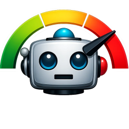

# Slop Watch



**Slop Watch** is a Chrome extension that acts as a crowdsourced AI "slop" detector for YouTube. It empowers users to vote, identify, and filter out AI-generated low-effort content across YouTube videos and channels.

## Features

- **Crowdsourced Detection**: Users collaboratively vote on whether a YouTube video or channel is "AI Slop" or "Human-made".
- **Visual Overlays**: Injects subtle indicator badges on YouTube video thumbnails and channel pages, showing the percentage probability of the content being AI-generated.
- **Customizable Filtering**: Automatically hide or blur out videos and channels that exceed a user-defined "AI chance" threshold (e.g., hide videos that are >75% likely to be AI).
- **Popup Controls**: A sleek popup menu lets you easily toggle the extension on/off and adjust the filtering thresholds for videos and channels.
- **Privacy Focused**: No sign-in required. Votes are tracked anonymously.

## Installation (Developer Mode)

1. Clone or download this repository to your local machine:
   ```bash
   git clone https://github.com/adityabhandari781/Slop-Watch.git
   ```
2. Open Google Chrome and navigate to the Extensions page at `chrome://extensions/`.
3. Enable **Developer mode** using the toggle switch in the top right corner.
4. Click the **Load unpacked** button in the top left.
5. Select the folder containing the cloned repository.

The extension should now be installed and active on YouTube!

## Usage

1. Navigate to YouTube.
2. You will notice small badges on video thumbnails showing the current "AI chance". You can hover over and click these badges to interact with them and cast your own vote.
3. Similar badges exist on channel pages next to the channel name.
4. Click the **Slop Watch** extension icon in your Chrome toolbar to open the popup. From here, you can adjust the sliders to automatically hide content that is deemed too "sloppy" by the community.